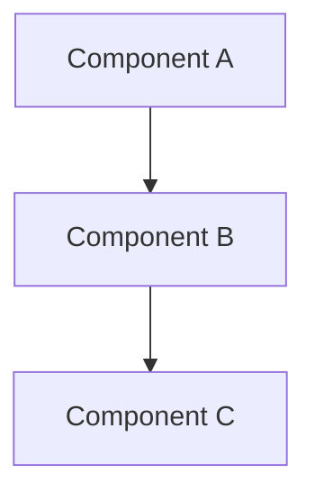

Generate architecture diagrams for the project.

## Instructions

1. Activate skills: `dependency-graph`, `mermaid-diagram`
2. Analyze the project structure using Glob and Read to understand:
   - Directory layout and module boundaries
   - Import/require relationships between files
   - External dependencies and integrations
   - Data flow between major components

3. Determine the diagram type based on $ARGUMENTS:
   - If $ARGUMENTS is "deps": focus on the dependency graph
   - If $ARGUMENTS is "flow": focus on data flow
   - If $ARGUMENTS is "all" or empty: generate both

### Dependency Graph
- Show module/component relationships
- Include external packages and integrations
- Use a Mermaid `graph TD` diagram

### Data Flow
- Show how data moves between major components
- Include entry points (API routes, CLI commands, etc.)
- Show data stores and external services
- Use a Mermaid `flowchart LR` diagram

4. Output diagrams in fenced mermaid code blocks:

````

````

5. Also update `docs/ARCHITECTURE.md` with the generated diagrams
6. Confirm what was generated and where it was saved
